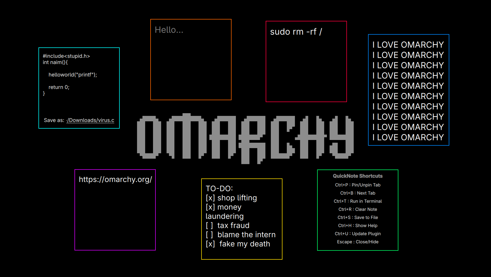

<div align="center">

# QuickNote for Omarchy

A lightning-fast, sticky note plugin designed natively for the Omarchy shell.

</div>

## Preview



## Features

- **Floating Sticky Notes**: Right-click the icon to spawn notes directly on your desktop.
- **7 Independent Tabs**: Quickly switch between multiple notes (`Ctrl+B`).
- **Interactive Checkboxes**: Click on `[ ]` or `[x]` in your text to instantly toggle them.
- **Run in Terminal**: Highlight text and press `Ctrl+T` to run it in Bash.
- **Save to File**: Press `Ctrl+S` to export notes to a specific file.
- **Drag & Drop**: Easily drop text files or snippets straight into your notes.
- **Clickable Links**: Click any URL to instantly open it in your browser.

### Keyboard Shortcuts
*(Press `Ctrl+H` at any time while the panel is open to view this)*

| Shortcut | Action |
|----------|--------|
| `Ctrl+P` | Pin/Unpin the current tab to your desktop as a sticky note |
| `Ctrl+B` | Cycle to the next buffer |
| `Ctrl+T` | Run selected text (or entire buffer) in terminal |
| `Ctrl+R` | Clear the entire buffer |
| `Ctrl+S` | Open the "Save as:" prompt |
| `Ctrl+U` | Update plugin |
| `Ctrl+H` | Show the shortcut help overlay |
| `Ctrl++` / `Ctrl+-` | Increase / Decrease editor font size |
| `Escape` | Close the panel or hide the active overlay |

## Installation

```bash
# 1. Clone
git clone https://github.com/Pilpup/quick-note ~/.local/share/quick-note
cd ~/.local/share/quick-note

# 2. Compile and install
./install.sh
```

## Update

```bash
cd ~/.local/share/quick-note
./update.sh
```
*(You can also press `Ctrl+U` while inside the QuickNote panel to trigger this automatically!)*

## Uninstallation

```bash
cd ~/.local/share/quick-note
./uninstall.sh
cd ~
rm -rf ~/.local/share/quick-note

```
Thanks.
